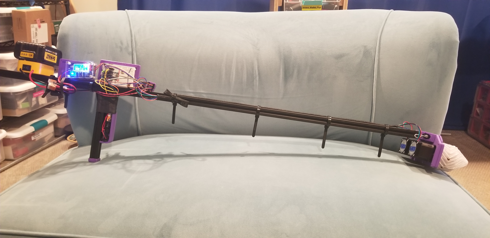
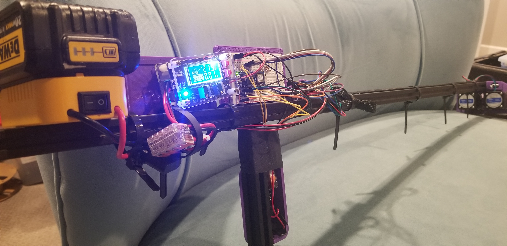
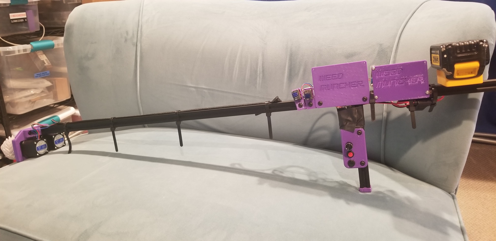
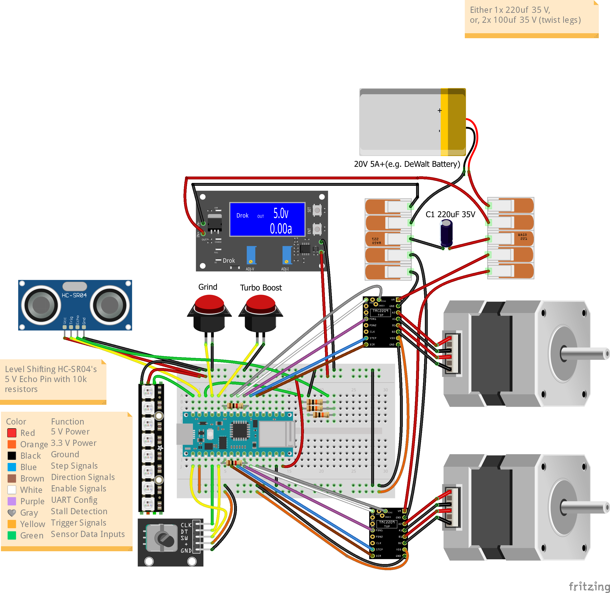
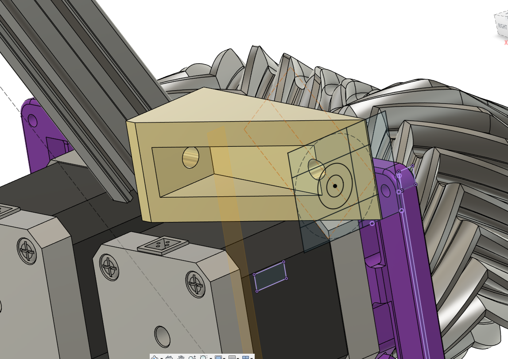
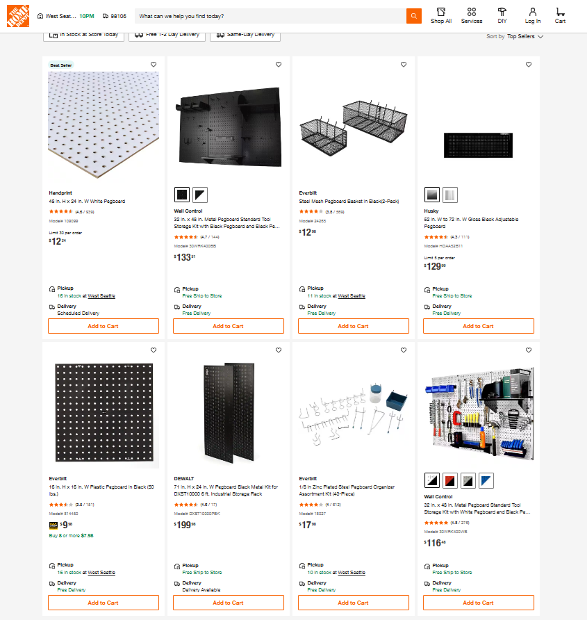

# Project: Pet Sapling Savior, or, Pet Weed Euthanizer?

## Description
An Arduino or ESP32 powered, Mostly 3D‐Printed Smart Pet Weed Euthanizer/Relocator that grips unwanted plants, gently uproots them.  Use to annihilate, or deposit sapling-worthy seedlings into your chosen grow tray—combining garden cleanup, and with mini reforestation.

Inspired by conversations on V1 Engineering forum, see https://forum.v1e.com/t/how-about-a-m3dpmower/36759  topic for context/details.

Built two separate versions, a V1 Engineering Jackpot with FluidNC on ESP32, and, an Arduino Nano 33 IoT version.

Available on [Printables](https://www.printables.com/model/1276001-pet-weed-euthanizer-or-pet-sapling-savior-in-progr), [GitHub](https://github.com/aaronse/weed-muncher).

This Project was inspired by conversations on V1 Engineering forum, see https://forum.v1e.com/t/how-about-a-m3dpmower/36759  topic for context/details.   

ASMR video of earlier Iteration #2 tests…

<table><tr>
<td>

</td>
<td>

</td>
<td>

</td>
</tr></table>

### WHY?
- I hate weeding, and avoid chemicals, plus I'd like to relocate otherwise unwanted saplings to areas needing reforesting, or, yards of people that like/deserve weeds 😉.
- Best selling Weeders are unable to grip smaller weeds/saplings like the ton of Maple tree ones that drove me to this. 
- This is Phase 1 of having IOT+AI powered machines to do my bidding, before they make me do theirs.
 
### WHAT's SPECIAL?
- Fast cordless yard fun way to relocate pet saplings, or, euthanize pet weeds.  
- Design includes many components that can be repurposed for other DIY tools.
- Uses mix of TPU infill/density and [Linear Spring Compliant Mechanisms](https://forum.v1e.com/t/linear-spring-compliant-mechanisms-designing-calculating-force-and-deflection/48891) to simulate pressure exerted by human hands gripping and pulling saplings/weeds without breaking them (well tries too...). 
- Today's chemical free [Best selling Weeders](https://www.amazon.com/gp/bestsellers/lawn-garden/553934) are designed for either large deep rooted weeds, or, for people to bend and kneed down to grip and pull out small weeds by hand.  There's got to be a better way...  Maybe this DIY tool ?
- Pulling small saplings/weeds saves time compared to repeatedly cutting/trimming weeds until their root system exhausts and dies.
- **NO Coding** needed for FluidNC controller board based builds.  Just upload [config.yaml](fluidnc/config.yaml) via Web UI, restart, then go relocating/hunting...

## Functions
- Grip, pull and discard, or, collect for relocation.
- Normal grip and pull.
- Turbo grip and pull, mode for rapid munching, and suborbital sapling/weed launching. 

## 2. Software & Hardware

- [x] **Software List**: CAD/design tools and libraries...
  - [VS Code](https://code.visualstudio.com/), [Arduino IDE](https://www.arduino.cc/en/software/), [PlatformIO](https://platformio.org/), [FluidNC](http://wiki.fluidnc.com/en/home)/[ESP3D](https://github.com/luc-github/ESP3D), [Fusion 360](https://www.autodesk.com/products/fusion-360), [OpenSCAD](https://openscad.org/), [Fritzing](https://fritzing.org/).

- [x] **Hardware List**: 
    - BOM contains latest set of parts that are working for me.  I tried many more components than what are listed here.  Let me know if you want to see the full list, only shared subset here to keep instructions straight forward.   
      - Recommend 2x Nema 17 84oz with 2x TMC2209 for max pulling fun :-)
      - **Power**:
        - [AI chat about Buck convertor options](https://chatgpt.com/share/680bc146-582c-800b-8d66-930ea82643ff)
  - [X] Provided info to build either (A) Arduino, or (B) V1 Engineering Fluid NC ESP32 based build :
    - [X] Option (A), Arduino Controller:
      - https://store.arduino.cc/products/arduino-nano-33-iot-with-headers
    - [X] Option (B), V1 Engineering JackPot Controller (ESP32, FluidNC): 
      - https://www.v1e.com/products/jackpot-cnc-controller
    
## BOM

|   Total Price | Description                                                                                                                                               | Link / Comments                                                                                                                                                                                                                                                                                                                                                                                                               |
|--------------:|:----------------------------------------------------------------------------------------------------------------------------------------------------------|:------------------------------------------------------------------------------------------------------------------------------------------------------------------------------------------------------------------------------------------------------------------------------------------------------------------------------------------------------------------------------------------------------------------------------|
|            27 | Arduino Nano 33 IoT with Headers [ABX00032]                                                                                                               | "https://www.amazon.com/dp/B07WPFQZQ1 - https://store.arduino.cc/products/arduino-nano-33-iot-with-headers - https://mm.digikey.com/Volume0/opasdata/d220001/medias/docus/697/ABX00032_Web.pdf - https://docs.arduino.cc/hardware/nano-33-iot/#tech-specs - https://mm.digikey.com/Volume0/opasdata/d220001/medias/docus/697/ABX00032_Web.pdf - https://docs.arduino.cc/hardware/nano-33-iot/#tech-specs" |
|            28 | STEPPERONLINE 2A 59Ncm 84oz Nema 17 Stepper Motor Bipolar 48mm                                                                                            | https://www.amazon.com/dp/B00PNEQKC0                                                                                                                                                                                                                                                                                                                                                                                          |
|            10 | 12pcs 12mm Mini Latching Push Button Switch ON-Off AC 250V/1.5A 125V/3A                                                                                   | https://www.amazon.com/dp/B0CGTXMLKL                                                                                                                                                                                                                                                                                                                                                                                          |
|             6 | 15pcs 220uF 35V 8x12mm Electrolytic Capacitor 220 UF MFD 35 Volt 0.32x0.47in Aluminum Capacitors                                                          | https://www.amazon.com/dp/B0CMQCG3M8                                                                                                                                                                                                                                                                                                                                                                                          |
|            11 | 2pcs 12V-36V DC Voltage Protection Module Digital Low Voltage Protector Disconnect Switch Over Discharge Protection Module                                | https://www.amazon.com/dp/B07QNXM4LS                                                                                                                                                                                                                                                                                                                                                                                          |
|            16 | 2pcs Switched, Fused Power Adapter for Dewalt 20V Battery                                                                                                 | https://www.amazon.com/dp/B0CRK9CN4D                                                                                                                                                                                                                                                                                                                                                                                          |
|            21 | 28pcs WAGO 221 Lever Nuts, Assortment with Case, Includes 221-2401, 221-412, 221-413, 221-415                                                             | https://www.amazon.com/dp/B0CJ5QF3VX                                                                                                                                                                                                                                                                                                                                                                                          |
|             9 | 6pcs ELEGOO Half Breadboard Kit (400 Points, 2 pairs of power rails)                                                                                      | https://www.amazon.com/dp/B0CYPVMK9J                                                                                                                                                                                                                                                                                                                                                                                          |
|            10 | 630pcs BOJACK 0-to-1M Ohm 1% 1/4W (17 diff values) Metal Film Resistor Kit                                                                                | https://www.amazon.com/dp/B07QXP4KVZ                                                                                                                                                                                                                                                                                                                                                                                          |
|            15 | DROK LCD Screen DC Buck Converter Adjustable Voltage Regulator 12V 6V-32V to 1.5-32V 5A, LCD Screen Step Down Converter with USB Port and Protective Case | https://www.amazon.com/dp/B07JZ2GQJF                                                                                                                                                                                                                                                                                                                                                                                          |

### 3. Wiring Diagram
- [X] Draw clear schematic (PNG/PDF).
- [X] Annotate each connection with a brief caption.

### Arduino Nano 33 IoT (3.3 V logic)

| Function                   | Board Pin | Device Pin         | Wire Color |
|----------------------------|-----------|--------------------|------------|
| STEP1                      | D3        | STEP               | 🟦 Blue    |
| DIR1                       | D2        | DIR                | 🟫 Brown   |
| EN1                        | D5        | EN                 | ⬜ White   |
| TX1 (to PDN_UART1)         | D7        | TX (with 1kΩ)      | 🟪 Purple  |
| RX1 (from PDN_UART1)       | D4        | RX                 | 🟪 Purple  |
| StallGuard1 (DIAG1)        | D6        | DIAG               | 🩶 Gray    |
| STEP2                      | D18       | STEP               | 🟦 Blue    |
| DIR2                       | D17       | DIR                | 🟫 Brown   |
| EN2                        | D20       | EN                 | ⬜ White   |
| TX2 (to PDN_UART2)         | D16       | TX (with 1kΩ)      | 🟪 Purple  |
| RX2 (from PDN_UART2)       | D19       | RX                 | 🟪 Purple  |
| StallGuard2 (DIAG2)        | D21       | DIAG               | 🩶 Gray    |
| Rotary Encoder CLK         | D14       | CLK                | 🟩 Green   |
| Rotary Encoder DT          | D15       | DT                 | 🟨 Yellow  |
| Rotary Encoder SW          | D13       | SW                 | 🟨 Yellow  |
| Turbo Button               | D8        | Button             | 🟨 Yellow  |
| Grind Button               | D9        | Button             | 🟨 Yellow  |
| US Trigger (TRIG)          | D11       | Trigger            | 🟨 Yellow  |
| US Echo (ECHO)             | D10       | Echo               | 🟩 Green   |
| NeoPixel Data              | D12       | NeoPixel           | ⬜ White   |

### 4. Code
- [x] Fully commented Arduino sketch.
- [x] Summary of code behavior.
  - The Weed Puller wakes up by setting up its buttons, rotary encoder, and motor drivers for smooth control and stall detection. It reads the Grind and Turbo buttons, the rotary encoder for speed adjustment, and the encoder switch to set the pulling direction.

  - Pressing Grind lets you pull weeds at a custom speed; Turbo gives you max power instantly. If the motors detect a stall, the system shuts them down and flashes a red warning until you're ready to go again. It also keeps an eye on weed distance with an ultrasonic sensor and shows real-time status over USB for easy debugging.

- [x] Full code repository at [https://github.com/aaronse/weed-muncher](https://github.com/aaronse/weed-muncher)

### 5. 3D Printing Instructions

| Qty    | File Name                            | Material   | Layer Height   | Infill   | Support   | Print Settings                       | Purpose/Comment                                                                                                                                                               |
|:-------|:-------------------------------------|:-----------|:---------------|:---------|:----------|:-------------------------------------|:------------------------------------------------------------------------------------------------------------------------------------------------------------------------------|
| 1      | chasis.stl                           | PETG       | 0.32mm         | 40%      | No        | 0.6mm noz, 3 walls, 3 top/bot layers | Mount grinder assembly to pole mounts                                                                                                                                         |
| 1      | grinder-tire-tapered.stl             | HS TPU     | 0.32mm         | 0%       | No        | 0.6mm noz, 1 wall, 1 top/bot layer   | Tapered double helical grip 'n pull                                                                                                                                           |
| 1      | grinder-tire-tapered-mir.stl         | HS TPU     | 0.32mm         | 0%       | No        | 0.6mm noz, 1 wall, 1 top/bot layer   | Mirrored evil twin for meshing.                                                                                                                                               |
| 2      | grinder-core.stl                     | PETG       | 0.32mm         | 40%      | No        | 0.6mm noz, 3 walls, 3 top/bot layers | Based on metal 2020 right angle brackets, but customized for this build                                                                                                       |
| 1      | grinder-flex-mount.stl               | PETG       | 0.32mm         | 40%      | No        | 0.6mm noz, 3 walls, 3 top/bot layers | Plate to mount Steppers motors with integrated Linear spring compliant mechanism.                                                                                             |
| 1      | guard-grip-gt2.stl                   | PETG       | 0.32mm         | 40%      | No        | 0.6mm noz, 3 walls, 3 top/bot layers | Holds brackets, and grips dust/debris guard to protect steppers.                                                                                                              |
| 2      | 2020-bracket-right-angle.stl         |            | 0.32mm         | 40%      | No        | 0.6mm noz, 3 walls, 3 top/bot layers | Mount pole to grinder assembly.                                                                                                                                               |
| 2      | 2020-cap.stl                         | HS TPU     | 0.32mm         | 20%      | No        | 0.6mm noz, 3 walls, 3 top/bot layers | End CAPs to make 2020 less stabby.                                                                                                                                            |
| 0 or 1 | 2020-mount-breadboard-half.stl       | PETG       | 0.32mm         | 20%      | No        | 0.6mm noz, 3 walls, 3 top/bot layers | ONLY Arduino build.  Mount for half breadboards, includes logo upside down, trick print.  Consider the separate _base_ and _frame_ versions if your printer bed isn't sticky. |
| 0 or 1 | 2020-mount-breadboard-half-base.stl  | PETG       | 0.32mm         | 20%      | No        | 0.6mm noz, 3 walls, 3 top/bot layers | ONLY Arduino build, maybe…  This "base" and "frame" are for the meek not comfortable printing engraved logo upside down.                                                      |
| 0 or 1 | 2020-mount-breadboard-half-frame.stl | PETG       | 0.32mm         | 20%      | No        | 0.6mm noz, 3 walls, 3 top/bot layers | ONLY Arduino build, maybe…  See above                                                                                                                                         |
| 0 or 2 | 2020-mount-tmc2209.stl               | TPU        | 0.32mm         | 20%      | No        | 0.6mm noz, 3 walls, 3 top/bot layers | ONLY Arduino build.  Temporary mounts for TMC2209 until I figure out better solution.  They don't fit in breadboards.                                                         |
| 0 or 1 | 2020-mount-jackpot.stl               | PETG       | 0.32mm         | 20%      | No        | 0.6mm noz, 3 walls, 3 top/bot layers | ONLY for V1 Engineering Jackpot build                                                                                                                                         |
| 0 or 1 | trigger-lefty.stl                    | PETG       | 0.32mm         | 40%      | No        | 0.6mm noz, 3 walls, 3 top/bot layers | ONLY if User is Left handed                                                                                                                                                   |
| 0 or 1 | trigger-righty.stl                   | PETG       | 0.32mm         | 40%      | No        | 0.6mm noz, 3 walls, 3 top/bot layers | ONLY if User is Right handed                                                                                                                                                  |

### 6. Assembly Instructions
- [ ] Step-by-step bullets (e.g. “1. Insert stepper into jaw housing; 2. Route wires through handle; …”).
- [ ] Alignment or torque tips (e.g. jaw mesh clearance).

### 7. Demo & Usage Instructions
- [ ] Power-on and mode selection (Pull vs. Release).
- [ ] Operating tips (e.g. hold at 30° angle, watch for stall-flash).
- [ ] Safety note (keep fingers clear of gears).

### 8. Additional Notes & Tips
- [ ] Troubleshooting pointers (e.g. check wiring if it stalls).
- [ ] Optional enhancements (e.g. add LCD status display).

### 9. Photos & Videos
- [ ] Finished product: multiple angles.
- [ ] Wiring close-ups.
- [ ] In-action demo GIF or short video (pull + relocate cycle).

### 10. Final Packaging & Submission
- [ ] Populate the `Printable_Arduino_Project_Template.pdf` with your content.
- [ ] Upload all STLs, code, diagrams, and the filled template to Printables.com.
- [ ] Ensure safety—no hazardous features.
- [ ] Submit before **Apr 27, 2025** (use code `PRINTABLES25` if you need parts).

### 11. (Optional) Clout Boosters
- [ ] Embed your YouTube demo link in the project description.
- [ ] Share teaser clips on social media with `#PrintablesContest`.

- Trigger Design
  - https://www.youtube.com/watch?v=H3J8FiLNEtc
  1:07
  - Airwolf trigger, turbo, rockets...
    - 0.35 https://www.youtube.com/watch?v=PigDNRQyNwE
https://installer.fluidnc.com/

## Firmware
- FluidNC
  - http://wiki.fluidnc.com/en/config/control
  - Macros http://wiki.fluidnc.com/en/config/macros
  - Configuring Pins http://wiki.fluidnc.com/en/config/config_IO
  - ESP32 Dev Kit Pins http://wiki.fluidnc.com/en/hardware/esp32_pin_reference
  - IPC via WebSockets/TCP http://wiki.fluidnc.com/en/support/interface/websockets
  - 

## TODO/TASKS
- CAD Design edits
  - Prevent weeds sneaking behind, add funnel/guide?

  - Grinder Assembly
    - Grinder Core
      - Add lip to stop tire pulling towards Flex Mount plate
    - Grinder Tire
      - Reduce rotation angle so 0.4mm layer height slicer doesn't add "top" line segments. 
      - Prevent slip off: More bumps/recesses, or make existing bigger?
      - Modify design so Slicer 0.72mm wall width results in _inner hub wall_ and _tooth wall_ touching/bonding.

## HISTORY
- 1st Tire Print 
  - (3hr 12mins, 15% retractions) Slicer config: 2 walls, alternative wall, infill 20%, 0.32mm layer height
  - Stiffer than expected
- 2nd Grinder Tire print ()
  - (1hr 51mins, 11%) Slice config: 2 walls, 0.66mm, line width, NO alternative wall, 0% infill, 0.36mm layer height
    - ⚠️🤷‍♂️ Counter intuitively, SAVED print time using 0.32mm layer height instead of 0.4mm.  Reason is steep overhang angle of the gear teeth results in more wall material being added, when laying thick layers like 0.4mm.  Added task to reduce rotation angle of sweep, so thicker faster single walls are possible, 
  - Goals flexible print that still grips Grinder Core

## DESIGN
- Grinder Flex Mount
  - Design uses _stepped recess bore holes_, looked at [various bottom recess options](./docs/cads-flat-bottom-recess.htm)
   - To support grabbing weeds of varying thickness, the design uses linear spring compliant mechanism for resistive flex.  Goal is 30N or more resistive force, 3.5mm limited range of motion.
     - Considered [pros/cons of various materials for compliant mechanisms](./docs/compliant-mechanism-materials.htm)
     - Considered [various Open Source FEM software](./docs/fem-software-options.htm)
  - Intentionally spaced mount holes 1" OC for optional pegboard mounting.

- Grinder Wheel Treads
  - Design has conical features with tiller
    - Fusion 360 Coils swept along spiral tapered path 
    - https://www.youtube.com/watch?v=8WW2_HtuV9A
  - Morley Kert, Fusion 360 "Create Form" to make twisted scaled structures Twist
    - https://www.youtube.com/watch?v=FTLb_tus4F4

- Pole to Grinder mounts
  - History/context:
    - Was concerned about 3D print being strong enough.  Designing and printing anyway to confirm/correct my understanding/theory with data...
    - Considered 3D printed like... 
      
    - Considered common easy to source brackets.  Ideally 1" wide with centered holes.
      - Best Selling Corner Braces https://www.homedepot.com/b/Building-Materials-Building-Hardware-Corner-Braces/N-5yc1vZc8hr 
      - https://www.homedepot.com/p/Everbilt-1-in-Steel-Zinc-Plated-Corner-Brace-4-Pack-24590/327599496

## ALTERNATIVE HARDWARE CONSIDERED

- PegBoard (alternative to CNC/Printed plates).
  - Popular 1" OC, 1/4" holes, Pegboard at HomeDepot:
    - Best Seller... Hardboard, painted White Acrylic  [48 in. H x 24 in. W White Pegboard](https://www.homedepot.com/p/Handprint-48-in-H-x-24-in-W-White-Pegboard-109099/202093803)
    - [16 in. H x 16 in. W Plastic Pegboard in Black (50 lbs.)](https://www.homedepot.com/p/Everbilt-16-in-H-x-16-in-W-Plastic-Pegboard-in-Black-50-lbs-814450/317815422)
    - Some popular/accessible options...
      

## 📄 License

⚠️ This project is for **personal, non-commercial use only**, and is licensed under the [Creative Commons BY-NC-SA 4.0](https://creativecommons.org/licenses/by-nc-sa/4.0/) license.

You are free to:
- ✅ Use it
- ✅ Remix it
- ✅ Build your own version at home

As long as you:
- ❌ Don't sell it or make money from it
- ✅ Give credit
- ✅ Share under the same license

😏 *Interested in selling parts or kits?*  
Am open to commercial licensing.  Any help paying for my kids' college fees is appreciated, cheers!  Contact via https://github.com/aaronse/weed-muncher/issues

**Commercial use or resale of any parts, models, or derivatives is strictly prohibited.**
